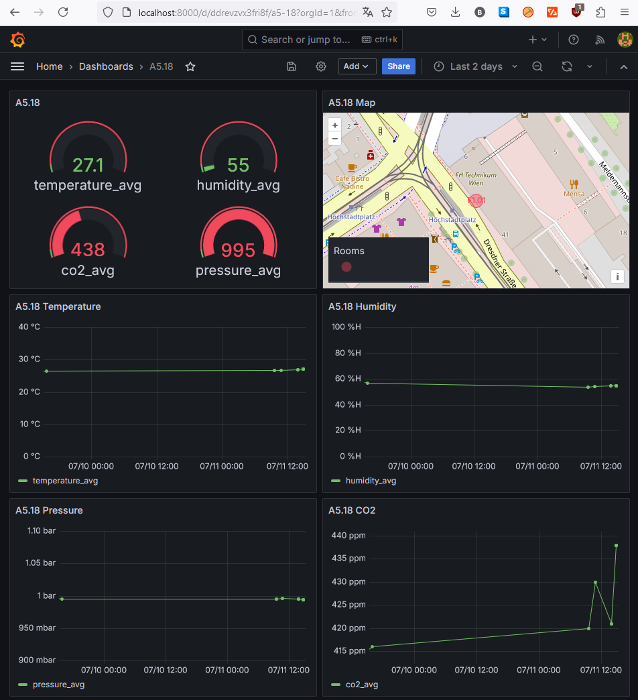

# IndoorAirQuality

This repo sets up an IoT data processing and visualization platform using Docker containers. It includes components for data ingestion, storage, processing, and visualization. The platform utilizes FIWARE components such as Orion-LD for context management, QuantumLeap for time-series data storage management, CrateDB for data storage, and Grafana for visualization.  
Additionally, it includes a Python NGSI-Proxy integrating the Magenta IoT Hub Business plattform for accessing the sensor devices using its proprietary REST-API.  
The NGSI-proxy will fetch the multiple data values from 60 sensor devices, processing them, and updating context data in Orion-LD.

Indoor air quality sensors in 60 rooms on UAS Technikum Vienna campus improve the working environment for students and staff. [FHTW News: FH Technikum Wien setzt neuen Maßstab für gesunde Raumluft](https://www.technikum-wien.at/news/iot-fh-technikum-wien-setzt-neuen-masstab-fur-gesunde-raumluft/)

This is the FiWare integration of "FHTW Raumluft" devices. This project can be seen as starting-point for a FHTW campus digital twin.

## Components

FIWARE components:
- **Orion-LD:** Context broker for managing context data in NGSI-LD format.
- **QuantumLeap:** Stores time-series data received from Orion-LD.
- **Grafana:** Dashboard visualization tool for analyzing data stored in QuantumLeap.
- **MongoDB:** Database for storing non-time-series data.
- **CrateDB:** Distributed SQL database for storing large volumes of time-series data efficiently.

External components:
- **Magenta IoT Hub Business:** A (proprietary) IoT-plattform hosted by Magenta

Sourcecode:
- **NGSI_Proxy**: A python script to fetch sensor data, processes them, and updates context data in Orion-LD.

## Install & Run locally on docker

Details see [docs/Docker.md](./docs/Docker.md)

### 1. Start Docker containers:
```shell
docker compose up -d
```

### 2. Entry points

- Grafana Frontend: [http://localhost:3000](http://localhost:3000).  
    The defaul login is *admin/admin* (You are asked to change the pwd on first login)

    The frontend should look like this:
    

    To configure Grafana see [docs/Grafana.md](docs/Grafana.md)

## Documentation

### Entities

* Sensor
    - id        data[0]/id/id
    - name      data[0]/label

    - location

    - temperature
    - humidity
    - co2
    - pressure

## Further Reading

### FIWARE

- Tutorial: Time-Series Data, see https://fiware-tutorials.readthedocs.io/en/latest/time-series-data.html

### CrateDB

- CrateDB SQL Skalar functions: https://cratedb.com/docs/crate/reference/en/latest/general/builtins/scalar-functions.html
