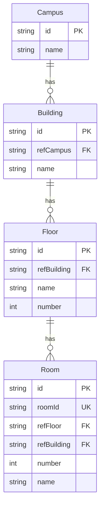
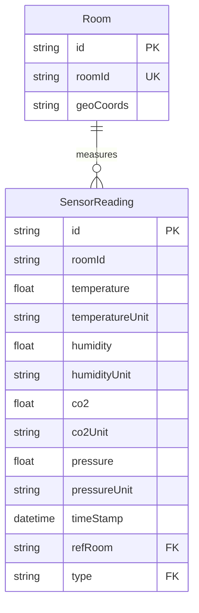
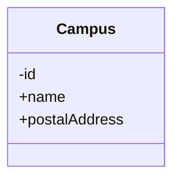
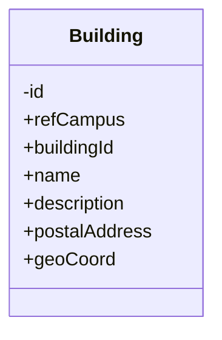
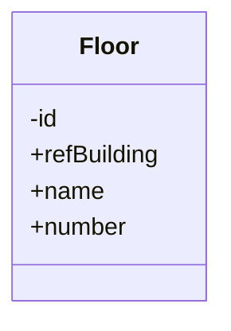
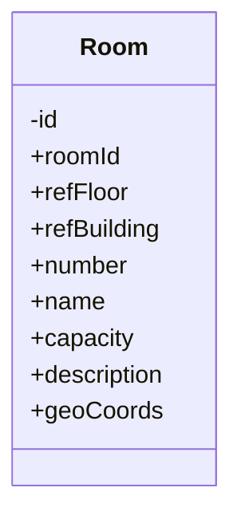
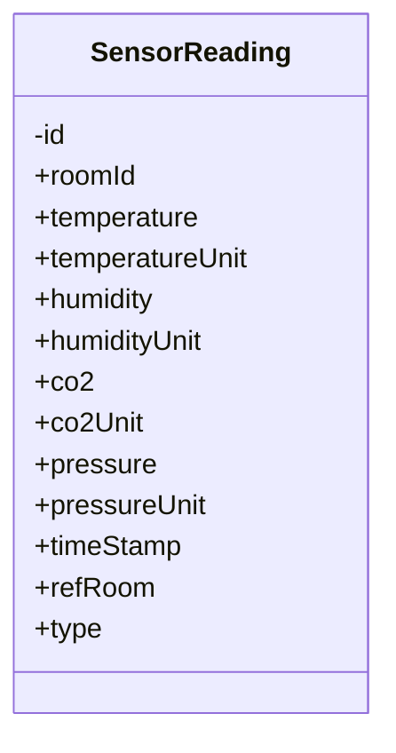

# Campus DigitalTWin - DataModel

## Structure

### Facility

### Environmental Metrics

## Entities

### Campus

Smart Data Model:
- dataModel.Organization: https://github.com/smart-data-models/dataModel.Organization/tree/master/Organization

Sample Data:
| id | name | postalAddress |
|----|------|---------------|
|    | FH Technikum Wien | Höchstädtplatz 6, 1200 Wien |

### Building

Smart Data Model: 
- dataModel.Building: https://github.com/smart-data-models/dataModel.Building/tree/master/Building
- dataModel.S4BLDG: https://github.com/smart-data-models/dataModel.S4BLDG/blob/master/Building/schema.json

Sample Data:
| id | buildingId | name | description | postalAddress | geoCoord |
|----|------------|------|-------------|---------------|----------|
|    | A | Gebäude A | Höhstädtpatz 5, 1200 Wien | Nebengebäude | 48.2390887,16.3783031 |
|    | B | Gebäude B | Höhstädtpatz 6, 1200 Wien | Verlängerung Gebäude A | 48.2387197,16.378449 |
|    | C | Gebäude C | Höhstädtpatz 4, 1200 Wien | Wohnturm | |
|    | E | Gebäude E | Giefinggasse 6, 1210 Wien | ENERGYBase | |
|    | F | Gebäude F | Höhstädtpatz 6, 1200 Wien | Hauptgebäude | 48.2390534;16.3774436 |

### Floor

Smart Data Model:
- ?dataModel.S4BLDG: https://github.com/smart-data-models/dataModel.S4BLDG/tree/master/BuildingSpace

Sample Data:
| id | name | number |
|----|------|--------|
|    | A0   | 0      |
|    | A1   | 1      |
|    | A2   | 2      |
|    | A3   | 3      |
|    | A4   | 4      |
|    | A5   | 5      |
|    | A6   | 6      |
|    | B0   | 0      |
|    | ...  | ...    |

### Room

Smart Data Model:
- ?dataModel.PointOfInterest: https://github.com/smart-data-models/dataModel.PointOfInterest/tree/master/PointOfInterest
- ?dataModel.S4BLDG: https://github.com/smart-data-models/dataModel.S4BLDG/tree/master/BuildingSpace

Sample Data:
| id | roomId | number | name | geoCoords | capacity |
|----|--------|--------|------|-----------|----------|
|    | A5.11 | 11 | Seminarraum | 48.2390887,16.3783031 | |
|    | A5.18 | 18 | Aufenthaltsbereich Workspace | 48.2390887,16.3783031 | |
|    | A6.09 | 9 | EDV Raum | 48.2390887,16.3783031 | |
|    | ... |||||

### SensorReading

Smart Data Model:
- datamodel.Environment: https://github.com/smart-data-models/dataModel.Environment/tree/master/IndoorEnvironmentObserved

Sample Data:
| id | roomId | temp | tempU | humi | humiU | co2 | co2U | press | pressU | timeStamp |
|----|--------|------|-------|------|-------|-----|------|-------|--------|-----------|
|| A2.07 | 26.5 | °C | 42.1 | %relH | 335 | ppm | 995.6 | mbar | 2024-07-26 11:39:07 |
|| B5.08 | 22.9 | °C | 48.0 | %relH | 321 | ppm | 993.3 | mbar | 2024-07-26 11:39:07 |
|| B2.05 | 24.6 | °C | 43.4 | %relH | 333 | ppm | 994.2 | mbar | 2024-07-26 11:39:07 |
|| A5.09 | 30.3 | °C | 36.6 | %relH | 388 | ppm | 992.7 | mbar | 2024-07-26 11:39:08 |
|| A5.18 | 29.5 | °C | 34.9 | %relH | 423 | ppm | 992.3 | mbar | 2024-07-26 11:39:08 |
|| F2.01 | 26.2 | °C | 53.5 | %relH | 513 | ppm | 992.0 | mbar | 2024-07-26 11:39:08 |
|| B0.06 | 23.4 | °C | 48.3 | %relH | 406 | ppm | 993.9 | mbar | 2024-07-26 11:39:09 |
|| B0.04 | 23.0 | °C | 47.5 | %relH | 461 | ppm | 995.4 | mbar | 2024-07-26 11:39:09 |
|| ... ||||

## Futher Integrations

- Room Bookings (from LV-Plan)
- Capacity utilization display
- integration of Building Services (Haustechnik)
- emergency plans and -scenarios
